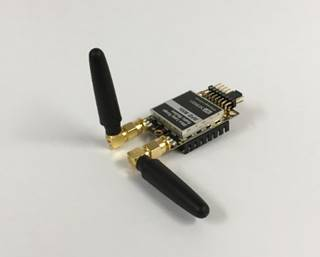

Diversity
===================================================

The RFD900x has two antenna ports and firmware which supports diversity operation
of antennas.  During the receive sequence the modem will check both antennas and
select the antenna with the best receive signal. The antenna selected during
receive is then also used for subsequent transmission.  In the case of only one
antenna connected, it will automatically select the port with the antenna
connected. Testing by Silicon Labs has shown that link budgets can be improved up
to the order of 8dB by employing a diversity scheme.

Spatial diversity
-----------------

Spatial diversity is the case where the antennas are separated by some distance
from one another. It is recommended that two antennas connected to the RDF900
modem be separated by at least 25cm, more if possible.

Polarisation diversity
----------------------

Polarisation diversity is the case where the antennas are perpendicular to each
other. i.e. one vertical, and one horizontal. This is effective in reducing
multipath effects which affect one or the other polarisation. This scheme also
helps to maintain the link between non-static objects such as aircraft performing
acrobatics by increasing the likelihood that one antenna will maintain the same
polarisation as an antenna on the other side of the link. :numref:`diversity_example_img` depicts how
two right-angle monopole antennas can be positioned to achieve polarisation
diversity.  This setup should ideally utilise a ground plane, but, it shown as an
example utilising polarisation diversity.

.. _diversity_example_img:

  Antenna configuration to achieve polarisation diversity