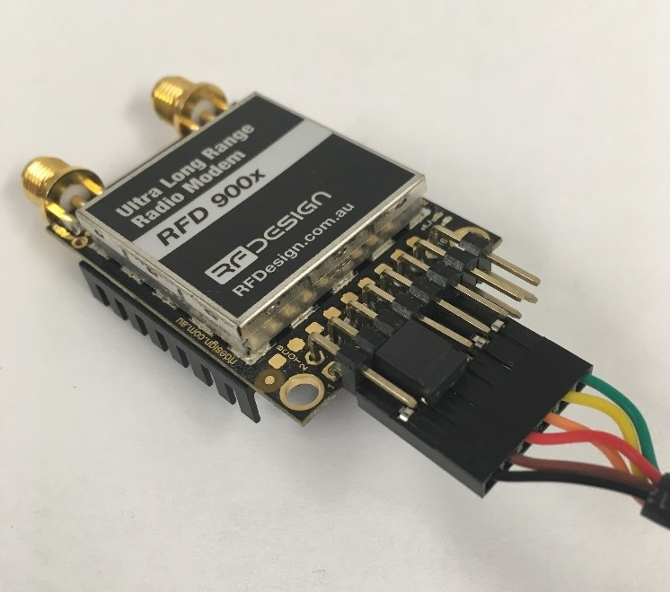

Frequently asked questions (FAQ)
===================================================

How many antennas do I need to use?
-----------------------------------

One is the minimum. Two is recommended.

How do I connect the FTDI cable to the modem?
---------------------------------------------

The black cable of the FTDI (pin 1) should connect to pin 1 on the modem.

  An FTDI cable connected to the RFD900x modem

What do I need to upload the firmware or to change the modem configuration?
---------------------------------------------------------------------------

Download the latest firmware (see “Useful Links”). Download the RFD900x Modem
Tools (see “Useful Links”). Connect the FTDI cable to the modem and to a computer.
Use the RFD900x Modem Tools to upload the latest firmware or to change the modem
configuration (see “RFD900x Modem Tools User Manual”). 

What should I do if the Flash Programmer keeps displaying error messages?
-------------------------------------------------------------------------

Make sure to connect the FTDI cable firmly into the modem. Make sure you choose
the correct COM port from the COM dropdown box and the correct baud rate. Try for
two more trials and if it still doesn’t work, disconnect and reconnect the modem.
Should it still fail open a terminal programme and perform a loop back test on the
cable. Short the orange and yellow pins of the FTDI cable with something like a
paper clip. Then using the terminal programme connect to the COM of the cable then
type some text if this text is not returned then it indicates there is likely a
fault with the FTDI cable where possible retry the upload process with a new cable.

I upgraded to multipoint firmware and the modems don't connect anymore?
-----------------------------------------------------------------------

The default setting for a modem is to have a NODEID set to 1.  A network must have
one node set to 0 to be the base.  The base node defines the synchronisation for
the whole network of nodes.

How do I configure 2 base stations and one Airborne platform with 3 modems?
---------------------------------------------------------------------------

Set the Airborne platform as follows:

.. code-block:: python
  
  NODEID = 0
  NODEDESTINATION = 65535 
  MAVLINK = 1

Set the ground station as follows:

.. code-block:: python

  NODEID = 1 or 2
  NODEDESTINATION = 0
  MAVLINK = 1

This will allow the airborne modem to handover to multiple ground stations as it
flies from the coverage area of one ground station, to another. Both ground
stations can be connected and can control the Airborne platform simultaneously via 
APM Planner using MAVLink.
 

 
