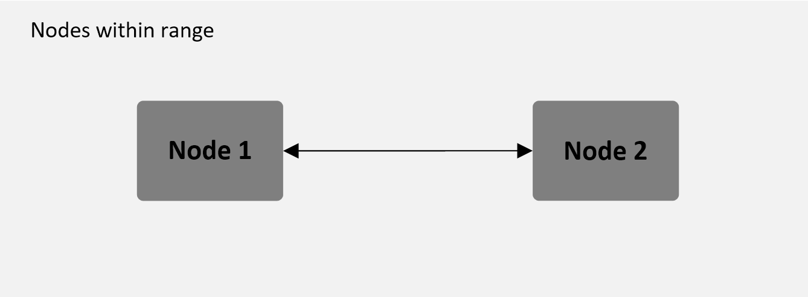
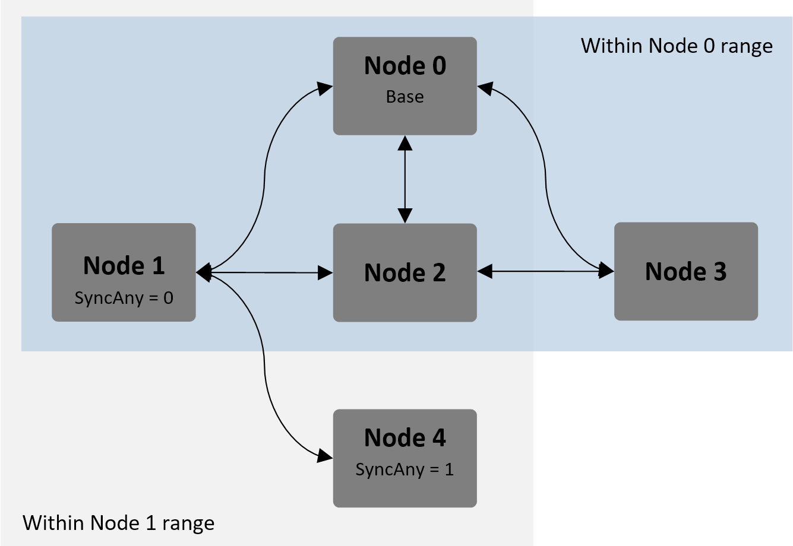
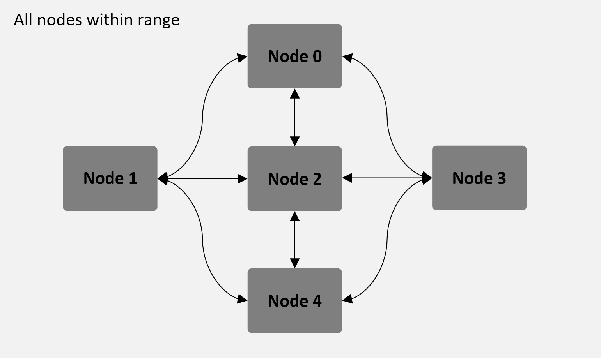

Network options
===================================================

RFD900x can be implemented in either simple pair (P2P), multipoint network (MP
Firmware Only), or asynchronous non-hopping mesh. The latter two are available
for download in the website (see “Useful Links”).

Simple pair (P2P)
-----------------

The out-of-the-box firmware of the RFD900x radio modem is set to work in
simple pair mode. If you purchased a bundle, you are only required to connect
the antennas and supply to initiate the link. As soon as the pair synchronises,
the on-board LED will become solid green.

  Simple pair mode

Multipoint network
------------------

This mode requires the Multipoint firmware to be loaded into the all network
radios. Check section “Useful links” for the download link, and refer to section
“RFD900x Flash Programmer tool” to flash the multipoint firmware. Refer to the
“Multipoint user manual” for setup and usage instructions.

  Example of multipoint network diagram

Asynchronous non-hopping mesh
-----------------------------

The asynchronous non-hopping mesh firmware offers a straight forward
communication option that allows the user to quickly transmit and receive data
across a great distance between two nodes or more. Figure 4-2 depicts this
communication topology. As long as all the nodes are within range and have
compatible parameters, communication between them will succeed. 

  Asynchronous non-hopping mesh topology

 
