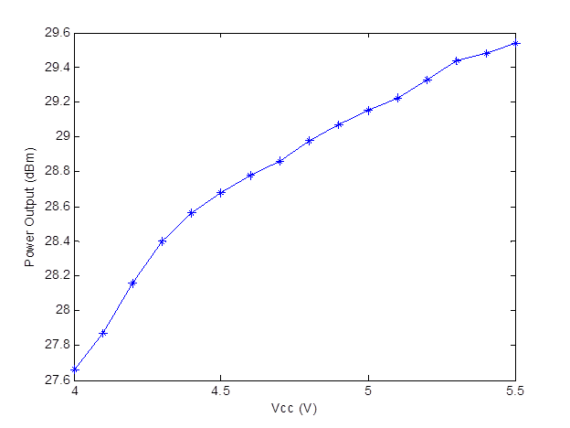
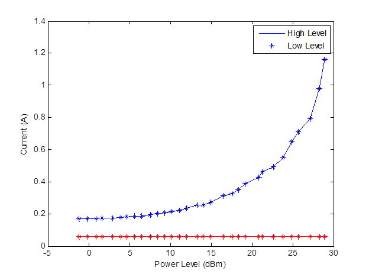

Performance
===========

:numref:`plot_powervssupply` shows how the output power of the RFD900x 
varies with supply voltage when the output power is set to +30dBm.   

.. _plot_powervssupply:

  Ouput power vs. input supply voltage 

:numref:`plot_currentvsconsumption` shows how the current through the RFD900x varies with 
the transmit power level. The current during transmission is shown 
by the ‘High Level’ plot and that during receive mode is shown by 
the ‘Low Level’ plot. 

.. _plot_currentvsconsumption:

  Current consumption vs. TX power level