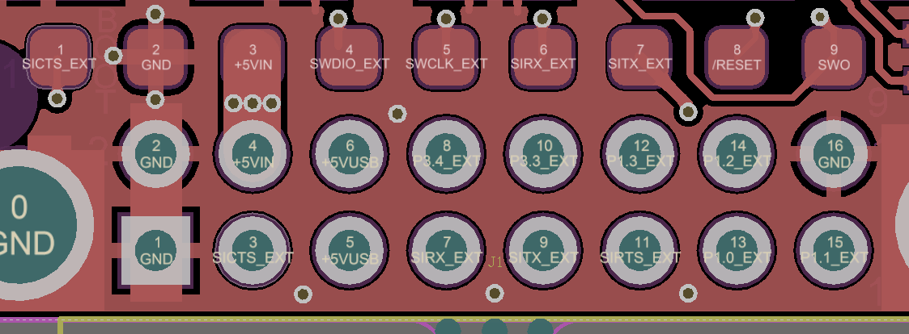

Pin signals and layout
===================================================

+--------+----------+---------------+-----------------------+------------------+
| Pin  # | Name     | Direction     | Description           | Max Voltage      |
+========+==========+===============+=======================+==================+
| 1      | GND      | `-`           | Ground                | 0V               |
+--------+----------+---------------+-----------------------+------------------+
| 2      | GND      | `-`           | Ground                | 0V               |
+--------+----------+---------------+-----------------------+------------------+
| 3      | CTS      | Either        | Clear to send         | 3.3V             |
+--------+----------+---------------+-----------------------+------------------+
| 4      | Vcc      | `-`           | Power supply          | 3.3V             |
+--------+----------+---------------+-----------------------+------------------+
| 5      | Vusb     | `-`           | Power supply from USB | 3.3V             |
+--------+----------+---------------+-----------------------+------------------+
| 6      | Vusb     | `-`           | Power supply from USB | 3.3V             |
+--------+----------+---------------+-----------------------+------------------+
| 7      | RX       | Input         | UART Data In          | 3.3V             |
+--------+----------+---------------+-----------------------+------------------+
| 8      | P3.4     | Either        | Digital I/O           | 3.3V             |
+--------+----------+---------------+-----------------------+------------------+
| 9      | TX       | Output        | UART Data Out         | 3.3V             |
+--------+----------+---------------+-----------------------+------------------+
| 10     | P3.3     | Either        | Digital I/O           | 3.3V             |
+--------+----------+---------------+-----------------------+------------------+
| 11     | RTS      | Either        | Request to send       | 3.3V             |
+--------+----------+---------------+-----------------------+------------------+
| 12     | P1.3     | Either        | Digital I/O           | 3.3V             |
+--------+----------+---------------+-----------------------+------------------+
| 13     | P1.0     | Either        | Digital I/O           | 3.3V             |
+--------+----------+---------------+-----------------------+------------------+
| 14     | P1.2     | Either        | Digital I/O           | 3.3V             |
+--------+----------+---------------+-----------------------+------------------+
| 15     | P1.1     | Either        | Digital  I/O, PPM I/O | 3.3V             |
+--------+----------+---------------+-----------------------+------------------+
| 16     | GND      | `-`           | Ground                | 0V               |
+--------+----------+---------------+-----------------------+------------------+

  Physical pin layout of the RFD900x Radio Modem

The FTDI cable (see “Useful Links”) is compatible with the RFD900x modem. 

Pin 1 of the FTDI cable (black wire) should connect to pin 1 of the RFD900x header.
In order to power the modem from the +5V USB power, a jumper is needed to connect
pins 4 and 6. 

To power the modem from an external +5V supply, connect the power to pins 2 and 4. 

In case there is a need to force the modem into boot mode, short circuit pad 9 (on
the 9 way test pads) with pin 16 or GND while applying power. The on-board LED will
become solid red when in boot mode.