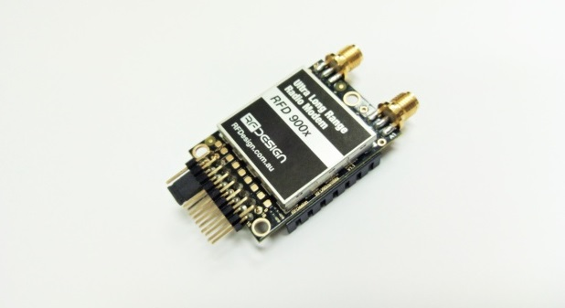
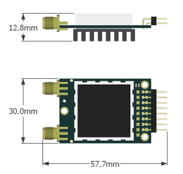

RFD900x Datasheet
#################

.. role:: strike
   :class: strike

902-928MHz frequency band 

Product Specifications and Performance
Flash Programmer User Manual

Features
========

• Out of the box RF communications. 
• Air data rate speeds of up to 500kbps
• Diversity antenna support
• Weight of 14g
• Outdoor RF line-of-site range of 40km or more depending on antenna configuration

Operational
===========

* Operating voltage: 5V, I/O Voltage (3.3V)
* Temperature range: -40°C to +85°C 
* Dimensions of 30mm x 57.7mm x 12.8mm
* Current consumption:
   - TX mode: ~1A peak at +30dBm, 
   - RX mode: 60mA (typical)
   
Applications
============

• Telemetry data
• UAV control
• Remote weather station
• House automation
• Long range RC

Contents
========

.. toctree::
   :maxdepth: 2

   Keyfeatures
   Specifications
   OutputPowerLevels
   Performance
   Pinout
   Mechanical
   Diversity
   NetworkOptions
   FAQ